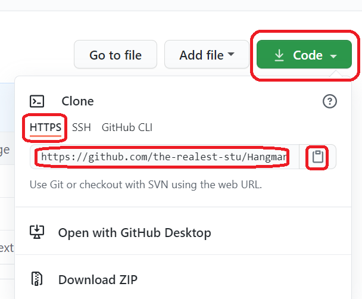
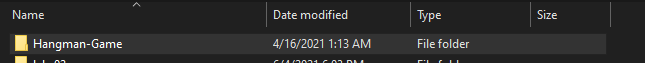

# Welcome to the Cit 281 Lab 2 Page

### What I learned:

- Learning about git using Windows Prompt.
- Git repositories.
- Learning about git commits and statuses.
- Cloning cloud repos locally.

### Purpose of Lab:

- Further familiarize ourselves with command prompts and working through routes to get to specific folders on our system.
- We got introduced to git and learned about commiting changes to files using git.
- We learned about the gitignore file, where filenames that are in that file are ignored by git.
- We also got to learn about cloning repos from GitHub and downloading it to a folder on our system.

### Outcome pics: 

### [**Back to home page**](https://uo-cit-itsbread33.github.io/ItsBread33.github.io/)

